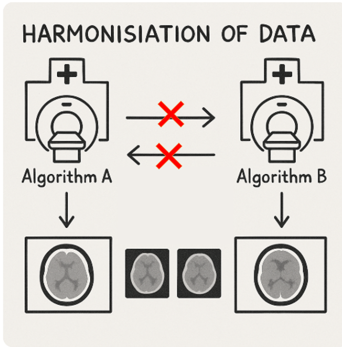

# Inverse Problems Course

A project focused on harmonising different reconstruction methods in scenarios where hospitals only share reconstructed images rather than underlaying raw data.

## Overview

In this project we explore a toy problem of two distinct reconstruction strategies—Algo A and Algo B—designed to simulate the situation of non-shared raw data. The main aim is to harmonise these reconstructions. To achieve this, we propose a harmonisation framework that leverages a minimisation problem composed of:
- A fidelity term that enforces consistency between the harmonised output and the orginal image either from Algo A or Algo B.
- A CNN-based classification loss that distinguishes whether an image was reconstructed using Algo A or Algo B.

The minimisation problem formulated in the report is as follows:

\right\}$$)

Here, u is the harmonised image, u₀ represents the original image either from Algo A or Algo B, 𝓛₍CNN₎(u) is the CNN classification loss, and λ is a regularisation parameter.

## Visualizing the Idea

The diagram below illustrates the overall approach and key steps involved in our project:

## Report

The full report can be found in the `Theory_part`, which details the theoretical framework, methodology, and results of our harmonisation approach.

## Additional Resources

For more information and insights into inverse problems in imaging, please visit the [Inverse Problems Course Page](https://tristanvanleeuwen.github.io/IP_and_Im_Lectures/intro.html).